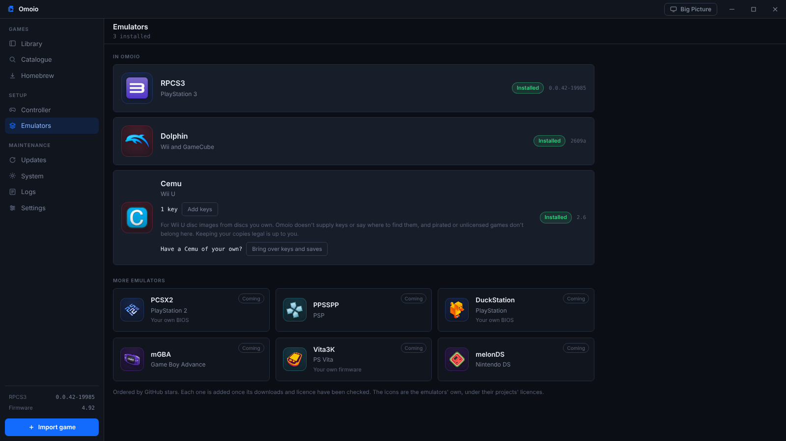
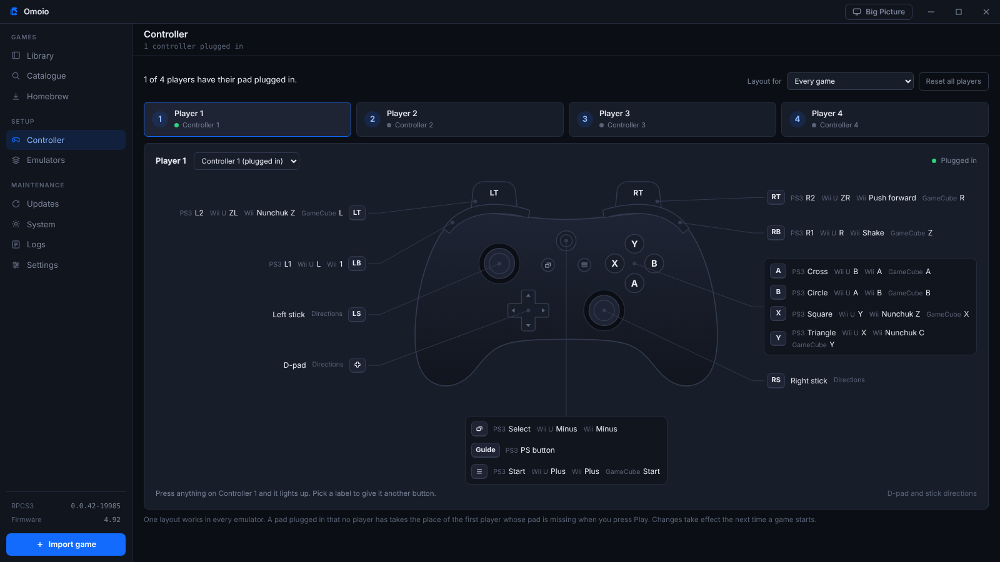

<p align="center">
  
</p>
<h1 align="center">Omoio</h1>
<p align="center">Your PS3 and Wii U games in one library. Press Play and Omoio sets up the emulator for you.</p>
<p align="center"><a href="https://omoio.app">omoio.app</a> · <a href="https://ko-fi.com/omoio">Support on Ko-fi</a></p>

[](https://youtu.be/wWmthRdoImE)


<sub>Covers in these pictures come from [RAWG](https://rawg.io).</sub>

Omoio is a game library for Windows. You import the dumps of games you own
and press Play. Omoio installs the emulator and sets up your controller, then
starts the game in its own window. It's made for big collections spread across
systems, the kind that sits on a few drives in a home lab.

Omoio is in very early development. PS3 games run through RPCS3 and Wii U games
through Cemu, and more systems are planned. Things will break, and feedback is
really appreciated, so open an issue.

## What you get

- One library for every system. Import a folder, a zip or 7z file, or scan a
  whole drive at once.
- Games run inside Omoio's window, fullscreen with F11, and you never see the
  emulator.
- RPCS3 and Cemu installed for you. RPCS3 is kept up to date, and Cemu is
  updated to the newest version Omoio has been tested with.
- One controller layout for every emulator, set by pressing the buttons, for up
  to four players.
- A Skylanders portal menu that puts figures and traps on the portal from your
  controller, in Giants on PS3 and in SWAP Force and Trap Team on Wii U.
- Community packs for every game, downloaded with one press: RPCS3's patches
  for PS3 games and Cemu's graphic packs for Wii U games, like 60 fps for
  Skylanders SWAP Force.
- For PS3 games, official updates, save backups and RPCS3's settings for each
  game. Homebrew installs from a .pkg you already have.
- For Wii U games, Cemu's settings for each game. Unpacked folders and .wua
  files work as they are, and disc images are read with your own keys.
- A catalogue of PS3 and Wii U games that tells you how well each one runs.
  If a game you import may not run well, Omoio says so first and points to
  another console's version that runs better, when there is one.
- Real covers from RAWG if you add a free key. Without one, Omoio shows the
  game's own picture (ICON0 for PS3, the boot picture or icon for Wii U), and
  draws a tile when there is none.

## Big Picture


Big Picture fills the screen and is made for a TV and a controller, with each
game's settings, community packs and saves inside it. Press View and Menu together
during a game to come back to Big Picture while the game keeps running. The same
two buttons take you back into the game.

## The Skylanders portal


Skylanders games need figures on a portal. Omoio opens a portal menu over the
game instead, and three games have it so far:

- Skylanders Giants, the PS3 version, through RPCS3
- Skylanders SWAP Force, the Wii U version, through Cemu
- Skylanders Trap Team, the Wii U version, through Cemu

During the game, press your controller's home button (Guide, PS or Home) and
the menu opens. You can pick another button in the game's panel. Choose a
character and it goes on the portal, and the same menu takes it off again. The
first time, the emulator's own figure maker makes the figure, and Omoio saves it
so the figure keeps what it has earned. Giants and Trap Masters come first in
each element and Minis last. Trap Masters and Minis carry a mark, and Giants
show the game's own Giant badge once the pictures are read. In
SWAP Force, swappers can be mixed: pick a top, then a bottom, and each one shows
how it moves.


In Trap Team, traps go on one at a time, as on a real portal. The Villains tab
shows all 46 villains, which ones you've caught and which of your traps holds
each, and picking a villain puts its trap on. Omoio reads the villain from what
the game saved in the trap. It only reads, and never writes to your figures.

Omoio doesn't come with the figures' pictures. It reads them from your own copy
of the game when you press Get pictures once in the game's panel. A Wii U game
imported as an unpacked folder or a .wua file is read as it is, and for a disc
image Omoio reads a .wua file that Cemu packed beside it. For Giants on PS3 it
reads the game's folder. A small separate program,
[omoio-portraits](https://github.com/Bertrram/omoio-portraits), does the reading.
Omoio downloads it only when you ask and checks it before it runs. The pictures
stay on your computer, and the screenshots above show them as they look once
read.

The other Skylanders games aren't supported yet.

## Install

Download Omoio from [omoio.app](https://omoio.app), or download
`Omoio_x.y.z_x64-setup.exe` from [Releases](../../releases), and run it.
It doesn't need admin rights. On first start it asks which emulators you want.
PS3 games also need Sony's free firmware: Omoio opens Sony's download page and
installs the file you pick.

From 0.2.2 on, Omoio updates itself. It downloads a new version in the
background and asks before it restarts, never while a game is running. If you
have an older version, install the newest one once by hand; it keeps your
library.

The installer isn't code signed yet, so Windows SmartScreen may warn you. Click
More info, then Run anyway.

## Q&A

<details>
<summary>Does Omoio come with games, or say where to find them?</summary>
<br>

No. Omoio plays dumps of games you own. It won't download games, link to them
or help you find them.

</details>

<details>
<summary>Which systems does it run?</summary>
<br>

PS3 through RPCS3 and Wii U through Cemu. The Emulators screen lists what comes
next: PS2, GameCube and Wii, PSP, PS1, Game Boy Advance, PS Vita and DS. Each
one is added once its download and its licence have been checked. PS4 isn't
among them: its emulator runs only games that are already decrypted, and a PS4
game you bought is locked to Sony's keys.



</details>

<details>
<summary>Do I need to install RPCS3 or Cemu first?</summary>
<br>

No. Omoio downloads their official builds. It keeps RPCS3 up to date and updates
Cemu to the newest version Omoio has been tested with, so a new Cemu waits until
Omoio has been checked against it, and your controllers keep working. It runs
them as separate programs, and you never have to open either one.

</details>

<details>
<summary>Why does Windows warn me about the installer?</summary>
<br>

SmartScreen warns about programs that aren't code signed, and a signing
certificate costs money every year, so Omoio doesn't have one yet. Click More
info, then Run anyway.

</details>

<details>
<summary>Where does the PS3 firmware come from?</summary>
<br>

From Sony. Omoio opens Sony's official firmware page, you download the file, and
Omoio installs the one you pick. It never fetches firmware by itself.

</details>

<details>
<summary>Why won't my Wii U disc image import?</summary>
<br>

Wii U disc images (.wud and .wux) are encrypted, and Cemu needs your disc's key
to read one. Add your own keys file on the Emulators screen. Omoio hands the keys
to Cemu and never supplies any. Unpacked game folders and .wua files (Cemu's own
archive) need no keys. Downloads in NUS form aren't supported.

</details>

<details>
<summary>Which controllers work?</summary>
<br>

Xbox controllers, and other pads that speak XInput, work in both emulators.
Other pads work in RPCS3 through SDL. In Cemu, PS5 and PS4 controllers
(DualSense, DualSense Edge and DualShock 4) and the Switch Pro Controller work
through SDL too, as does an 8BitDo pad set to its Switch or XInput mode. Other
pads don't work in Cemu yet. Plug a pad in before you press Play, since Omoio
tells Cemu about the pads it finds then. You set one layout on the Controller
screen and Omoio uses it everywhere, for up to four players. Every button is labelled with what it does on PS3 and Wii U, and you
change one by picking its label and pressing the new button. Big Picture has the
same screen, used with the pad.



</details>

<details>
<summary>Where are my saves?</summary>
<br>

PS3 saves are in Omoio's own copy of RPCS3. Omoio backs them up before every
game update, and the game's panel can back them up or put an older copy back.
Wii U saves are in Omoio's copy of Cemu, without backups so far.

</details>

<details>
<summary>Does Omoio change the emulators' settings?</summary>
<br>

Only where it has a reason it can point to. It writes your controller layout. For
PS3 games it also sets a resolution that fits your screen, and switches on a
short list of fixes for named games, each with its reason shown. Everything else
stays at the emulator's defaults, and you can change any setting for each game.

</details>

<details>
<summary>What are community packs?</summary>
<br>

Changes the emulators' communities make for a game: RPCS3's patches for PS3
games, and Cemu's graphic packs for Wii U games, such as a sharper picture or
60 fps. Open a game, choose Community packs and press Download packs. They come
from RPCS3's and Cemu's own sources, and Cemu's are checked against the
checksum GitHub publishes. A pack stays off until you turn it on, unless it's a
fix, and then it says why it's on.

</details>

<details>
<summary>Where do the covers come from?</summary>
<br>

Without a RAWG key, Omoio shows the game's own picture from your dump: ICON0
for PS3 games and the boot picture for Wii U games. A Wii U disc image's files
are encrypted, so it gets the game's icon from its save once you've played it.
Until then, or when a game has no picture, Omoio draws a tile. Turn covers on
in Settings and add a free RAWG key, and Omoio shows RAWG's pictures with a
credit wherever they appear.

</details>

<details>
<summary>Does it run on Mac or Linux?</summary>
<br>

No, only on Windows.

</details>

<details>
<summary>Something broke. What should I send?</summary>
<br>

Open an issue that says which game it was and what happened. The Logs screen
keeps a log of every play session, and the one from when it went wrong helps a
lot.

</details>

## The small print

Omoio doesn't come with games and won't help you find any, so bring your own
dumps of games you own. It doesn't crack anything: Wii U disc images need your
own keys file, and Cemu does the decrypting. PS3 firmware comes from Sony's page,
downloaded by you. Covers come only from RAWG or your own games and saves, and the
Skylanders pictures only from your own copy of the game. Omoio has no connection with Activision, who
publish Skylanders. RPCS3 and Cemu are separate projects, run as
their official builds, and all credit for the emulation goes to them. The
Emulators screen shows each emulator's own icon, unchanged, under its project's
licence; [the notice beside them](src/icons/emulators/NOTICE.md) lists which.

## Build

Needs Rust, Node 20 or newer, and the Tauri prerequisites for Windows.

```
npm install
npm run tauri icon Images/Icon/omoio-icon-1024.png    # the app icons, once
npm run tauri dev      # run locally
npm run tauri build -- --no-bundle    # build omoio.exe
```

The installer also needs the key its updates are signed with, in
`TAURI_SIGNING_PRIVATE_KEY`, so it's built for releases only.

## Support

Omoio is free and stays free. If it saved you some setup and you want to help,
you can buy me a coffee on [Ko-fi](https://ko-fi.com/omoio). It goes into
getting the installer code signed and adding the next emulators.

## Licence

[MIT](LICENSE). RPCS3, Cemu, the community packs and the emulators' icons keep
their own licences.
