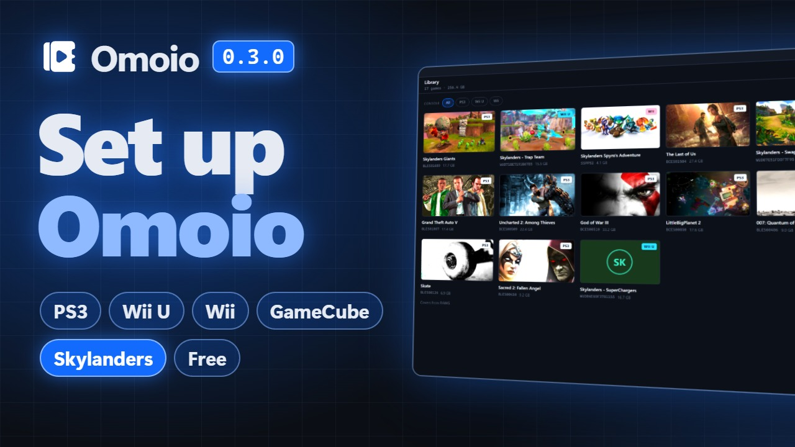

<p align="center">
  
</p>
<h1 align="center">Omoio</h1>
<p align="center">Your PS3, Wii U, Wii and GameCube games in one library. Press Play and Omoio sets up the emulator for you.</p>
<p align="center"><a href="https://omoio.app">omoio.app</a> · <a href="https://discord.gg/ghnAm5CbdP">Discord</a> · <a href="https://ko-fi.com/omoio">Support on Ko-fi</a></p>

[](https://youtu.be/wWmthRdoImE)


<sub>Covers in these pictures come from [RAWG](https://rawg.io).</sub>

Omoio is a game library for Windows. Import the dumps of games you own and
press Play. Omoio installs the emulator, sets up your controller and starts the
game in its own window. It's made for big collections spread over several
systems, the kind that sits on a few drives in a home lab.

Omoio is in very early development. PS3 games run through RPCS3, Wii U games
through Cemu, and Wii and GameCube games through Dolphin. More systems are
planned. Things will break, and feedback really helps, so open an issue or
come and say hi on [Discord](https://discord.gg/ghnAm5CbdP).

## What you get

- One library for every system, with each game tagged by its console. Import
  a folder, a zip or 7z file, or scan a whole drive at once.
- Games run inside Omoio's window, fullscreen with F11, and you never see the
  emulator.
- RPCS3, Cemu and Dolphin installed for you. RPCS3 is kept up to date, and Cemu
  and Dolphin are updated to the newest version Omoio has been tested with.
- One controller layout for every emulator, set by pressing the buttons, for up
  to four players.
- A Skylanders portal menu that puts figures, traps, vehicles and crystals on
  the portal from your controller, in Spyro's Adventure, Giants, SWAP Force and
  Trap Team on PS3, in SWAP Force, Trap Team, SuperChargers and Imaginators on
  Wii U and in Spyro's Adventure on Wii.
- Community packs: RPCS3's patches for PS3 games and Cemu's graphic packs for
  Wii U games, like 60 fps for Skylanders SWAP Force, downloaded with one
  press. Wii and GameCube games get the patches and cheat codes that come with
  Dolphin, ready to switch on, and the graphics mods Dolphin comes with too. For
  Skylanders: Spyro's Adventure and Giants that's Bloom Removal, Bloom Blurred
  and Native Resolution Bloom.
- Save backups for PS3, Wii U, Wii and GameCube games. The game's panel backs
  up its saves and puts an older copy back.
- For PS3 games, official updates and RPCS3's settings for each game. Saves are
  backed up before every update. Homebrew installs from a .pkg you already
  have.
- For Wii U games, Cemu's settings for each game. Unpacked folders and .wua
  files work as they are, and disc images are read with your own keys.
- For Wii and GameCube games, disc images play where they are, and so do a
  disc's files unpacked into a folder. In a Wii game your pad is a Wii Remote
  with a Nunchuk, and Dolphin's picture is sized for your screen.
- A catalogue of PS3, Wii U, Wii and GameCube games that tells you how well
  each one runs, from [RPCS3's compatibility list](https://rpcs3.net/compatibility),
  the [Cemu wiki](https://wiki.cemu.info/) and the
  [Dolphin wiki](https://wiki.dolphin-emu.org/) (CC BY-SA 3.0). If a game you
  import may not run well, Omoio says so first and points to another console's
  version that runs better, when there is one.
- Real covers from RAWG if you add a free key. Without one, Omoio shows the
  game's own picture (ICON0 for PS3, the boot picture or icon for Wii U, the
  banner for GameCube and the save's banner for Wii), and draws a tile when
  there is none.

## Big Picture


Big Picture fills the screen and is made for a TV and a controller, with each
game's settings, community packs and saves inside it. Press View and Menu together
during a game to come back to Big Picture while the game keeps running. The same
two buttons take you back into the game.

## The Skylanders portal


Skylanders games need figures on a portal. Omoio opens a portal menu over the
game instead, and these games have it so far:

- Skylanders Spyro's Adventure on PS3 and Wii, through RPCS3 and Dolphin
- Skylanders Giants on PS3, through RPCS3
- Skylanders SWAP Force on PS3 and Wii U, through RPCS3 and Cemu
- Skylanders Trap Team on PS3 and Wii U, through RPCS3 and Cemu
- Skylanders SuperChargers on Wii U, through Cemu
- Skylanders Imaginators on Wii U, through Cemu

During the game, press your controller's home button (Guide, PS or Home) and
the menu opens. You can pick another button in the game's panel. Choose a
character and it goes on the portal, and the same menu takes it off again. The
first time, the emulator's own figure maker makes the figure, and Omoio saves it
so the figure keeps what it has earned. Giants and Trap Masters come first in
each element and Minis last, and a newer game's own come before them: the
SuperChargers in SuperChargers, the Senseis in Imaginators. Trap Masters,
SuperChargers, Senseis and Minis carry a mark, and Giants show the game's own
Giant badge once the pictures are read. In SWAP Force, swappers can be mixed:
pick a top, then a bottom, and each one shows how it moves.

To delete a saved figure, hold the top face button on it for five seconds. A
bar fills the picture while you hold, and the file goes to the Recycle Bin, so
you can still get it back. A figure on the portal has to come off first.

In Spyro's Adventure on Wii, the menu works Dolphin's own Skylanders Manager out
of sight: it puts figures on, takes them off and makes new ones. A figure made
in Cemu or RPCS3 works in Dolphin too.


In Trap Team, traps go on one at a time, as on a real portal. The Villains tab
shows all 46 villains, which ones you've caught and which of your traps holds
each, and picking a villain puts its trap on. Omoio reads the villain from what
the game saved in the trap. It only reads, and never writes to your figures.

<!-- A screenshot of the garage in SuperChargers goes here, once it has been
     played: design/screenshots/portal-garage.jpg -->

In SuperChargers, the Vehicles tab is a garage with a column each for land, sea
and sky vehicles, your saved ones first. The game uses one vehicle at a time, so
a vehicle you put on takes the place of the one on the portal. Each vehicle
shows the SuperCharger made for it, and the top face button (Y on an Xbox pad)
puts the two on together, which SuperCharges the vehicle. A saved vehicle keeps
the mods you bought for it. Trophies have a tab of their own, and traps, items
and adventure packs from the earlier games come last, each saying what it does
in this game.

<!-- A screenshot of the Senseis tab in Imaginators goes here, once it has been
     played: design/screenshots/portal-senseis.jpg -->

In Imaginators, the Imaginators tab holds your Creation Crystals, the one you
used last first, and choosing one puts it on. Under them is a blank crystal of
each element and design. It always makes a new crystal in a new file, and the
game then asks you to make an Imaginator in it, so a crystal you have is never
used for another. The Senseis tab has a column for each battle class, so a
Knight or a Sorcerer is one look away, and each Sensei says which realms it
opens and what it teaches. Imaginators checks a factory signature on its own
figures that a figure made by an emulator doesn't have, so Omoio turns on
Cemu's Signature Patch, a community pack that takes that check away. It shows
in the game's Community packs, where you can turn it off. Figures, traps,
items, vehicles and trophies from the earlier games work too, each saying what
it does in this game.

Omoio doesn't come with the figures' pictures. It reads them from your own copy
of the game when you press Get pictures once in the game's panel. In Spyro's
Adventure on Wii the magic items and adventure packs get pictures too, small
sprites from the game. A Wii U game imported as an unpacked folder or a .wua
file is read as it is. A Wii U or Wii disc image can't be read as it is, so
Omoio asks first, then has the emulator make a temporary copy, reads the
pictures from it and deletes it again: Cemu makes it for a Wii U game, and
Dolphin's own DolphinTool for a Wii game. Omoio never decrypts anything
itself, and it tells you how much room the copy needs for the few minutes it
takes. For a PS3 game it reads the game's folder. A small separate program,
[omoio-portraits](https://github.com/Bertrram/omoio-portraits), does the
reading. Omoio downloads it only when you ask and checks it before it runs. The
pictures stay on your computer, and the screenshots above show them as they
look once read.

The menu isn't in SuperChargers and Imaginators on PS3 or in Giants, SWAP Force,
Trap Team and SuperChargers on Wii yet, and the other Skylanders games aren't
supported. In the catalogue, Skylanders games show whether the portal menu works
in them, and importing one where it doesn't warns you and names the version
where it does.

## Install

Download Omoio from [omoio.app](https://omoio.app), or download
`Omoio_x.y.z_x64-setup.exe` from [Releases](../../releases), and run it.
It doesn't need admin rights. On first start it asks which emulators you want.
PS3 games also need Sony's free firmware: Omoio opens Sony's download page and
installs the file you pick.

From 0.2.2 on, Omoio updates itself. It downloads a new version in the
background and asks before it restarts, never while a game is running. If you
have an older version, install the newest one once by hand; it keeps your
library.

The installer isn't code signed yet, so Windows SmartScreen may warn you. Click
More info, then Run anyway.

[](https://youtu.be/ioL5LjZmEXs)

The [setup guide](https://youtu.be/ioL5LjZmEXs) shows every step on screen,
from the download to your first game, then Big Picture, community packs, save
backups and the Skylanders portal menu. It has chapters, so you can skip to the
one you need.

## Q&A

<details>
<summary>Does Omoio come with games, or say where to find them?</summary>
<br>

No. Omoio plays dumps of games you own. It won't download games, link to them
or help you find them.

</details>

<details>
<summary>Which systems does it run?</summary>
<br>

PS3 through RPCS3, Wii U through Cemu, and Wii and GameCube through Dolphin.
The Emulators screen lists what comes next: PS2, PSP, PS1, Game Boy Advance,
PS Vita and DS. Each one is added once its download and its licence have been
checked. PS4 isn't among them: its emulator runs only games that are already
decrypted, and a PS4 game you bought is locked to Sony's keys.


</details>

<details>
<summary>Do I need to install RPCS3, Cemu or Dolphin first?</summary>
<br>

No. Omoio downloads their official builds, on the Emulators screen or when it
first starts. It keeps RPCS3 up to date, and updates Cemu and Dolphin to the
newest version Omoio has been tested with, so a new release waits until Omoio
has been checked against it, and your controllers keep working. Omoio checks
Dolphin's download before it installs it, and keeps its Dolphin in a folder of
its own, apart from any Dolphin you already have. It runs them as separate
programs, and you never have to open any of them.

</details>

<details>
<summary>Why does Windows warn me about the installer?</summary>
<br>

SmartScreen warns about programs that aren't code signed, and a signing
certificate costs money every year, so Omoio doesn't have one yet. Click More
info, then Run anyway.

</details>

<details>
<summary>Where does the PS3 firmware come from?</summary>
<br>

From Sony. Omoio opens Sony's official firmware page, you download the file, and
Omoio installs the one you pick. It never fetches firmware by itself.

</details>

<details>
<summary>Why won't my Wii U disc image import?</summary>
<br>

Wii U disc images (.wud and .wux) are encrypted, and Cemu needs your disc's key
to read one. Add your own keys file on the Emulators screen. Omoio hands the keys
to Cemu and never supplies any. Unpacked game folders and .wua files (Cemu's own
archive) need no keys. Downloads in NUS form aren't supported.

</details>

<details>
<summary>Which Wii and GameCube files import?</summary>
<br>

Disc images in the forms Dolphin reads: .iso, .gcm, .wbfs, .rvz, .wia, .gcz,
.ciso and .tgc. Omoio plays them where they are, as it does a Wii U .wua, and a
disc's files unpacked into a folder work too. Scanning a folder finds them. A
Wii channel (.wad) won't import: a channel is installed into the console's own
storage rather than played from a disc, and Omoio doesn't do that. For a game on
two discs, import both disc images. Omoio gives Dolphin both, and Dolphin puts
in the next one by itself when the game asks for it.

</details>

<details>
<summary>Which controllers work?</summary>
<br>

Xbox controllers, and other pads that speak XInput, work in all three
emulators. So do PS5 and PS4 controllers (DualSense, DualSense Edge and
DualShock 4), without DS4Windows, and the Switch Pro Controller. An 8BitDo pad
works set to its XInput mode, and in RPCS3 and Cemu set to its Switch mode too.
Other pads work in RPCS3 through SDL, but not in Cemu or Dolphin yet. Plug a pad
in before you press Play, since Omoio tells Cemu and Dolphin about the pads it
finds then. A PlayStation or Switch pad on its own is player 1 without being
picked. You set one layout on the Controller screen and Omoio uses it
everywhere, for up to four players. Every button is labelled with what it does
on PS3, Wii U, Wii and GameCube, and you change one by picking its label and
pressing the new button. Big Picture has the same screen, used with the pad.

A Wii game plays as a Wii Remote with a Nunchuk. The left stick is the
Nunchuk's stick, and the right stick moves the pointer. A and B are the bottom and right
buttons, with B on the right trigger too. The Nunchuk's Z is the left button and
the left trigger, C is the top button, and the right shoulder shakes the remote.
A GameCube game uses Dolphin's own layout for a gamepad. A real Wii Remote, the
Balance Board or another GameCube device you set up in Dolphin yourself stays
the way you set it up.


</details>

<details>
<summary>Where are my saves?</summary>
<br>

In Omoio's own copy of the emulator: PS3 saves in RPCS3, Wii U saves in Cemu,
and Wii and GameCube saves in Dolphin. The game's panel can back them up or put
an older copy back, and reinstalling the emulator leaves the copies alone. For
PS3 games, Omoio also backs up the saves before every game update.

</details>

<details>
<summary>Does Omoio change the emulators' settings?</summary>
<br>

Only where it has a reason it can point to. It writes your controller layout. For
PS3 games it also sets a resolution that fits your screen, and switches on a
short list of fixes for named games, each with its reason shown. For Wii and
GameCube games it sets Dolphin's internal resolution once, to the one Dolphin
itself suggests for your screen, kept within what your graphics card's memory
allows, and only if you haven't chosen one. It switches off Dolphin's
first-start questions, its update check and its keyboard shortcuts, so nothing
comes up over the game, and makes sure the game hears the pad only while its
window is in front, so presses in Big Picture and the portal menu don't reach
it. Everything else stays at the emulator's defaults, and for PS3 and Wii U
games you can change any setting for each game.

</details>

<details>
<summary>What are community packs?</summary>
<br>

Changes the emulators' communities make for a game: RPCS3's patches for PS3
games, Cemu's graphic packs for Wii U games, such as a sharper picture or
60 fps, and the patches and cheat codes that come with Dolphin for Wii and
GameCube games. Open a game and choose Community packs. For PS3 and Wii U
games, press Download packs. They come from RPCS3's and Cemu's own sources, and
Cemu's are checked against the checksum GitHub publishes. Dolphin's come with
Dolphin, so there's nothing to download. A pack stays off until you turn it on,
unless it's a fix or Dolphin has it on for that game, and then it says why it's
on.

Wii and GameCube games also get the graphics mods Dolphin comes with, under
Graphics mods in the same list. A game only gets the ones that change something
in it, and each is switched on for that game alone. Omoio turns on Dolphin's
graphics mods for the game while one of them is on. In Skylanders: Spyro's
Adventure and Giants that's Bloom Removal, Bloom Blurred and Native Resolution
Bloom.

</details>

<details>
<summary>Where do the covers come from?</summary>
<br>

Without a RAWG key, Omoio shows the game's own picture from your dump: ICON0
for PS3 games, the boot picture for Wii U games and the banner for GameCube
games. A Wii U disc image's files are encrypted, so it gets the game's icon from
its save once you've played it. A Wii game's banner is in the encrypted part of
the disc, so Omoio shows the one its save carries, once you've played and saved.
Until then, or when a game has no picture, Omoio draws a tile. Turn covers on
in Settings and add a free RAWG key, and Omoio shows RAWG's pictures with a
credit wherever they appear.

</details>

<details>
<summary>Does it run on Mac or Linux?</summary>
<br>

No, only on Windows.

</details>

<details>
<summary>Something broke. What should I send?</summary>
<br>

Open an issue that says which game it was and what happened. The Logs screen
keeps a log of every play session, and the one from when it went wrong helps a
lot.

</details>

## The small print

Omoio doesn't come with games and won't help you find any, so bring your own
dumps of games you own. It doesn't crack anything: Wii U disc images need your
own keys file, and Cemu does the decrypting, as Dolphin does for Wii discs.
PS3 firmware comes from Sony's page, downloaded by you. Covers come only from
RAWG or your own games and saves, and the Skylanders pictures only from your own
copy of the game. Omoio has no connection with Activision, who publish
Skylanders. RPCS3, Cemu and Dolphin are separate projects, run as
their official builds, and all credit for the emulation goes to them. The
Emulators screen shows each emulator's own icon, unchanged, under its project's
licence; [the notice beside them](src/icons/emulators/NOTICE.md) lists which.

## Build

Needs Rust, Node 20 or newer, and the Tauri prerequisites for Windows.

```
npm install
npm run tauri icon Images/Icon/omoio-icon-1024.png    # the app icons, once
npm run tauri dev      # run locally
npm run tauri build -- --no-bundle    # build omoio.exe
```

The installer also needs the key its updates are signed with, in
`TAURI_SIGNING_PRIVATE_KEY`, so it's built for releases only.

## Support

Omoio is free and stays free. If it saved you some setup and you want to help,
you can buy me a coffee on [Ko-fi](https://ko-fi.com/omoio). It goes into
getting the installer code signed and adding the next emulators.

## Licence

[MIT](LICENSE). RPCS3, Cemu, Dolphin, the community packs and the emulators'
icons keep their own licences.
